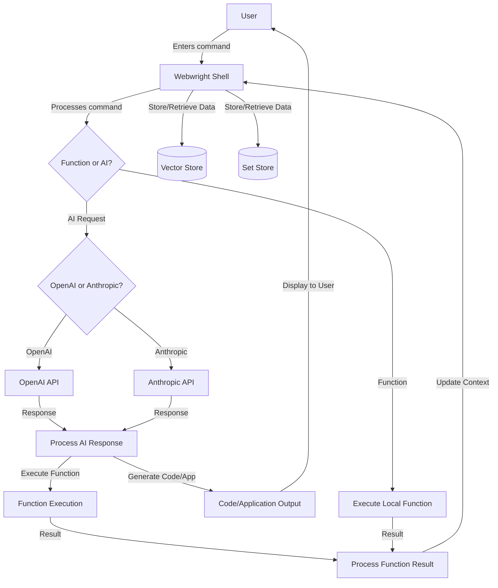

<div align="center">
  
</div>

# Webwright

**A Terminal Shell for Building and Deploying Websites Using AI**

Webwright is an AI-driven terminal shell designed to streamline the process of building, deploying, and managing websites.

It's not just a web development tool; it's an AI assistant for your computer, a ghost in the machine that can handle a variety of tasks, from opening URLs in your browser to committing code to GitHub, writing scripts, starting Docker containers, and much more.

## System Flow Diagram



This diagram illustrates the flow of Webwright's functionality, showing how user commands are processed, how AI requests are handled, and how data is stored and retrieved.


## Key Features

- **Website Development**: Build and deploy websites using AI-driven tools.
- **Code Generation**: Automatically generate code for your projects.
- **Project Management**: Create and manage projects effortlessly.
- **Version Control**: Commit code to GitHub directly from the terminal.
- **Docker Integration**: Start and manage Docker containers.
- **Browser Automation**: Open URLs and automate browser tasks.
- **Extensible Shell**: A versatile shell that can be extended with custom commands and scripts.

## Installation

You can install Webwright using `pip`:

```bash
pip install webwright
```

Webwright requires Anaconda and Docker to be configured on your system. Follow the links below for installation instructions:

- [Anaconda/Miniconda Installation](https://docs.anaconda.com/miniconda/miniconda-install/)
- [Docker Desktop Installation](https://www.docker.com/products/docker-desktop/)

## Getting Started

Once installed, you can start using Webwright by simply typing `webwright` in your terminal. Here's a quick overview of some commands:

### Open URLs in Your Browser

```bash
rare-parrot@openai ~\code\mitta\webwright $ open hackernews
```

### Create a New Project

```bash
rare-parrot@openai ~\code\mitta\webwright $ create project my-project
```

### Generate Code

```bash
rare-parrot@openai ~\code\mitta\webwright $ generate code --type python --output my_script.py
```

### Commit to GitHub

```bash
rare-parrot@openai ~\code\mitta\webwright $ git commit -m "Initial commit"
```

### Start Docker Containers

```bash
rare-parrot@openai ~\code\mitta\webwright $ docker start my-container
```

### AI-Powered Code Generation

Webwright can generate complex code snippets using AI. For example, to generate an ASCII fractal:

```bash
rare-parrot@openai ~\code\mitta\webwright $ generate fractal --size 20
```

### Example: Fractal Generation

Here's an example of a Python code snippet generated by Webwright to create a mandlebrot fractal:

```python
import matplotlib.pyplot as plt
import numpy as np

# Function to compute the Mandelbrot set
def mandelbrot(c, max_iter):
    z = c
    for n in range(max_iter):
        if abs(z) > 2:
            return n
        z = z*z + c
    return max_iter

# Generate the fractal
def generate_fractal(size):
    # Determine the plot boundaries
    x_min, x_max = -2.5, 1.5
    y_min, y_max = -2.0, 2.0

    width, height = (size*100, size*100)  # Increase resolution by multiplying size by 100
    x, y = np.linspace(x_min, x_max, width), np.linspace(y_min, y_max, height)
    fractal = np.zeros((width, height))

    for i in range(width):
        for j in range(height):
            fractal[i, j] = mandelbrot(complex(x[i], y[j]), 256)

    plt.imshow(fractal.T, extent=[x_min, x_max, y_min, y_max], cmap='hot')
    plt.colorbar()
    plt.title("Mandelbrot Fractal")
    plt.show()

# Generate a fractal of the given size
generate_fractal(20)

```

### Output


## Documentation

For detailed usage instructions and examples, visit the [Webwright Documentation](https://mitta.ai/docs/webwright).

## Contributing

Webwright is an open-source project. We welcome contributions!

## Community and Support

Join our community on [Slack](https://join.slack.com/t/mittaai/shared_invite/zt-2azbcv29i-CL74lmOksgvN54jhvmVWeA) for support, discussions, and to share your ideas and feedback.

## License

Webwright is open-source software licensed under the [MIT License](https://opensource.org/license/mit).

---

With Webwright, harness the power of AI to enhance your development workflow and make building and managing websites easier and more efficient than ever before. Try it today and experience the future of web development!