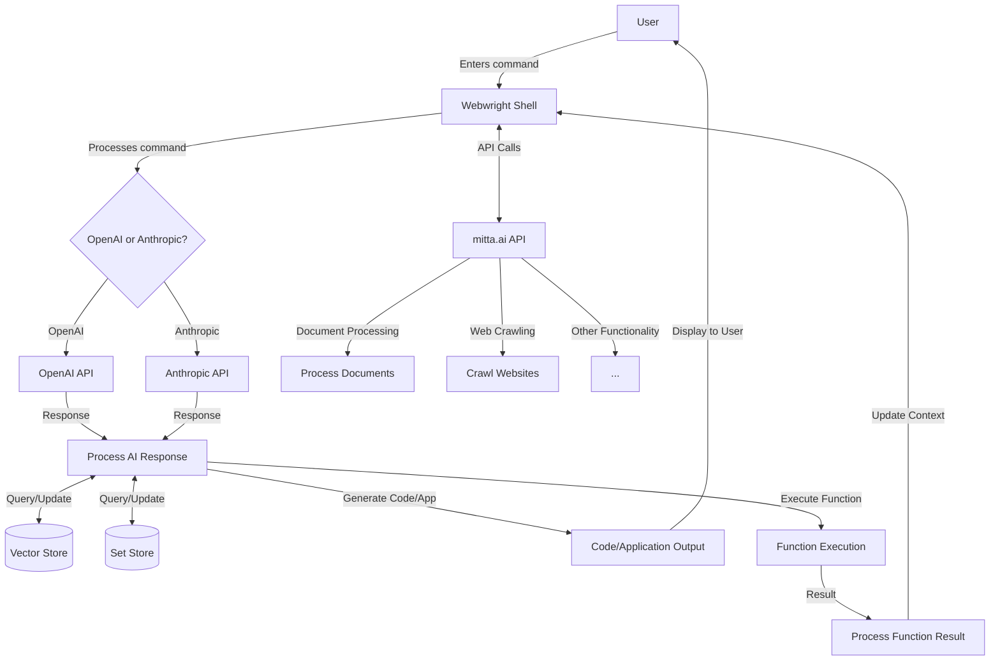

<div align="center">
  
</div>

# Webwright: The Ghost in Your Shell 👻💻

Webwright is more than just a terminal shell—it's a transformative tool that gets things done, plain and simple.

In the early days of computing, the command line was king. Webwright is for the tinkerers and hackers who remember that raw power. It taps into that primal, user-first ethos, acting as a ghost in your shell: an AI that speaks your language and understands your needs.

With Webwright, you're in control. Generate code, manage projects, deploy apps, and automate tasks—all from your terminal. It's the tool that puts power back in your hands.

This is computing at its rawest, most powerful, and most liberating.

Are you ready to unleash the ghost in your shell?

## 🔑 API Requirements

Webwright requires an API token from either OpenAI or Anthropic to function. You can obtain these tokens from:

- [OpenAI API Keys](https://platform.openai.com/account/api-keys)
- [Anthropic API Keys](https://console.anthropic.com/settings/keys)

Please ensure you have at least one of these API keys before proceeding with the installation.

## 🚀 Key Features

- 🌐 **AI-Powered Web Development**: Craft and launch websites with intelligent, AI-driven tools.
- 💻 **Smart Code Generation**: Let AI write code for you, boosting productivity and innovation.
- 📊 **Effortless Project Management**: Seamlessly create and oversee projects with AI assistance.
- 🔄 **Integrated Version Control**: Push your code to GitHub without leaving the terminal.
- 🐳 **Docker at Your Fingertips**: Effortlessly spin up and manage Docker containers.
- 🌐 **Browser Magic**: Automate web tasks and open URLs (or other apps) with simple commands.
- 🔧 **Infinitely Extensible**: Customize your shell with bespoke commands and scripts.

## Demo


## 🛠️ Installation
Webwright requires Anaconda and Docker to be configured on your system.

1. **Install Webwright** (coming soon)
   ```bash
   pip install webwright
   ```

2. **Set up dependencies**

  Webwright requires Anaconda and Docker to be configured on your system.
  - [Anaconda/Miniconda Installation](https://docs.anaconda.com/miniconda/miniconda-install/)
  - [Docker Desktop Installation](https://www.docker.com/products/docker-desktop/)

3. **Create and activate a Conda environment**
   ```bash
   conda create -n webwright python=3.8
   conda activate webwright
   ```

4. **Install Git**
   Ensure Git is installed in your Conda environment:
   ```bash
   conda install git
   ```

5. **Start Webwright**
   ```bash
   webwright
   ```

## 🔄 System Flow Diagram



This diagram illustrates the flow of Webwright's functionality, showing how user commands are processed, how AI requests are handled, and how data is stored and retrieved.

## Getting Started

Once installed, you can start using Webwright by simply typing `webwright` in your terminal. Here's a quick overview of some commands:

### Open URLs in Your Browser

```bash
open hackernews
```

### Create a New Project

```bash
create project my-project
```

### Generate Code

```bash
generate code --type python --output my_script.py
```

### Commit to GitHub

```bash
git commit -m "Initial commit"
```

### Start Docker Containers

```bash
docker start my-container
```

### AI-Powered Code Generation

Webwright can generate complex code snippets using AI. For example, to generate an ASCII fractal:

```bash
generate fractal --size 20
```

### Example: Fractal Generation

Here's an example of a Python code snippet generated by Webwright to create a mandlebrot fractal:

```python
import matplotlib.pyplot as plt
import numpy as np

# Function to compute the Mandelbrot set
def mandelbrot(c, max_iter):
    z = c
    for n in range(max_iter):
        if abs(z) > 2:
            return n
        z = z*z + c
    return max_iter

# Generate the fractal
def generate_fractal(size):
    # Determine the plot boundaries
    x_min, x_max = -2.5, 1.5
    y_min, y_max = -2.0, 2.0

    width, height = (size*100, size*100)  # Increase resolution by multiplying size by 100
    x, y = np.linspace(x_min, x_max, width), np.linspace(y_min, y_max, height)
    fractal = np.zeros((width, height))

    for i in range(width):
        for j in range(height):
            fractal[i, j] = mandelbrot(complex(x[i], y[j]), 256)

    plt.imshow(fractal.T, extent=[x_min, x_max, y_min, y_max], cmap='hot')
    plt.colorbar()
    plt.title("Mandelbrot Fractal")
    plt.show()

# Generate a fractal of the given size
generate_fractal(20)

```

### Output


### Developer Installation

For developers who want to install Webwright for testing, building, and running from source:

1. **Clone the Repository**
   ```bash
   git clone https://github.com/MittaAI/webwright.git
   cd webwright
   ```

2. **Set up Conda Environment**
   ```bash
   conda create -n webwright python=3.10
   conda activate webwright
   ```

3. **Install Dependencies**
   ```bash
   pip install -r requirements.txt
   ```

4. **Install Git (if not already installed)**
   ```bash
   conda install git
   ```
5. **Add GITHUB_TOKEN to Environment**
   ```bash
   $env:GITHUB_TOKEN = "your_github_token"
   ```
6. **Run Webwright from Source**
   ```bash
   python webwright/main.py
   ```

### Conda Initialization in VSCode

If you are using VSCode and need to get conda working in the editor, you might need to run the following command from the `condabin` directory:

```
./conda init powershell
```

This will set up the necessary configuration for conda to work properly within VSCode terminal sessions.

### Building and Testing

To build and test Webwright:

1. **Install Development Dependencies**
   ```bash
   pip install -r requirements-dev.txt
   ```

2. **Run Tests**
   ```bash
   pytest
   ```

3. **Build Package**
   ```bash
   python setup.py sdist bdist_wheel
   ```

### Git Setup for Developers

If you're planning to contribute to Webwright, make sure to set up your Git environment:

1. **Configure Git**
   ```bash
   git config --global user.name "Your Name"
   git config --global user.email "your.email@example.com"
   ```

2. **Create a New Branch for Your Changes**
   ```bash
   git checkout -b feature/your-feature-name
   ```

3. **Make Your Changes and Commit**
   ```bash
   git add .
   git commit -m "Description of your changes"
   ```

4. **Push Your Changes and Create a Pull Request**
   ```bash
   git push origin feature/your-feature-name
   ```
   Then, go to the GitHub repository and create a pull request for your branch.

Remember to always pull the latest changes from the main branch before starting your work:

```bash
git checkout main
git pull origin main
```

For more detailed contribution guidelines, please refer to our [CONTRIBUTING.md](link-to-contributing-file) file.

## Documentation

For detailed usage instructions and examples, visit the [Webwright Documentation](https://mitta.ai/docs/webwright).

## Contributing

Webwright is an open-source project. We welcome contributions!

## Community and Support

Join our community on [Slack](https://join.slack.com/t/mittaai/shared_invite/zt-2azbcv29i-CL74lmOksgvN54jhvmVWeA) for support, discussions, and to share your ideas and feedback.

## License

Webwright is open-source software licensed under the [MIT License](https://opensource.org/license/mit).

---

With Webwright, harness the power of AI to enhance your development workflow and make building and managing websites easier and more efficient than ever before. Try it today and experience the future of web development!

---

© Mitta Corp. All rights reserved 2024.
