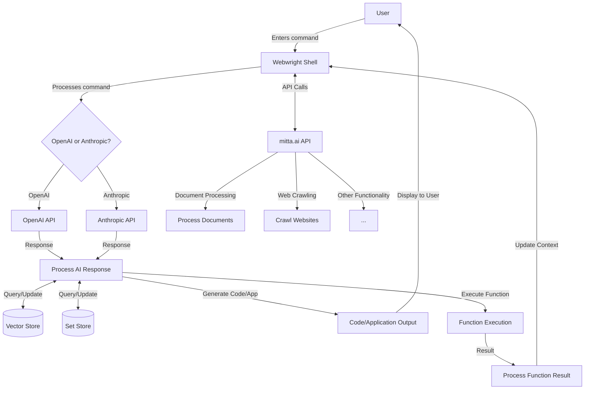

## 🔄 System Flow Diagram

```mermaid
graph TD
    A[User] -->|Enters command| B[Webwright Shell]
    B -->|Processes command| E{OpenAI or Anthropic?}
    E -->|OpenAI| F[OpenAI API]
    E -->|Anthropic| G[Anthropic API]
    F -->|Response| H[Process AI Response]
    G -->|Response| H
    H <-->|Query/Update| L[(Vector Store)]
    H <-->|Query/Update| M[(Set Store)]
    H -->|Generate Code/App| I[Code/Application Output]
    H -->|Execute Function| J[Function Execution]
    J -->|Result| K[Process Function Result]
    K -->|Update Context| B
    I -->|Display to User| A
    B <-->|API Calls| N[mitta.ai API]
    N -->|Document Processing| O[Process Documents]
    N -->|Web Crawling| P[Crawl Websites]
    N -->|Other Functionality| Q[...]
```

This diagram illustrates the flow of Webwright's functionality, showing how user commands are processed, how AI requests are handled, and how data is stored and retrieved.